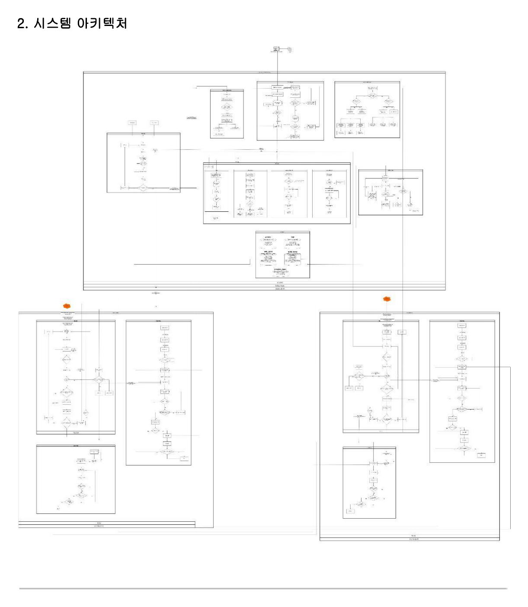

# TurtleBot4 Museum Security System

웹캠과 TurtleBot4 AMR을 활용한 **박물관 도난 방지 스마트 보안 시스템**입니다.  
고정 웹캠과 TurtleBot4의 OAK-D 카메라로 전시품과 도둑 객체를 탐지하고, 전시품 미검출 또는 도둑 탐지 상황이 발생하면 관리자 웹 대시보드에 알림을 표시하며 AMR이 도둑 위치로 출동해 추적합니다.

---

## 1. 프로젝트 개요

기존 박물관 보안 시스템은 CCTV와 인력 중심 감시에 의존하기 때문에 야간 시간대나 사각지대에서 대응이 지연될 수 있습니다.  
본 프로젝트는 **YOLO 객체 탐지**, **Flask 기반 관제 서버**, **SQLite 데이터베이스**, **ROS2 기반 TurtleBot4 자율주행**을 연동하여 도난 상황을 자동으로 감지하고 대응하는 것을 목표로 합니다.

### 주요 기능

- 웹캠 기반 전시품 실시간 탐지
- TurtleBot4 OAK-D 카메라 기반 전시품 및 도둑 탐지
- DB에 등록된 전시품 목록과 YOLO 탐지 결과 비교
- 전시품 미검출 시 도난 이벤트 생성
- 관리자 웹 대시보드에서 실시간 영상, 로그, 로봇 상태 확인
- Alert Popup을 통한 도난 상황 알림
- SMS 신고 기능 연동
- ROS2 / Nav2 기반 TurtleBot4 순찰
- Depth + TF 기반 도둑 좌표 계산
- robot2, robot8 간 중복 추적 방지

---

## 2. 폴더 구조

```text
turtlebot4_Museum/
├── README.md
└── C3_museum_src/
    ├── AMR/
    ├── Detection/
    └── System Monitor/
```

### AMR

TurtleBot4의 순찰, 도킹, 추적 모드를 담당합니다.

- 초기 위치 설정
- waypoint 기반 순찰
- 특정 전시품 위치 도착 시 `/arrive_position` 발행
- 도둑 좌표 수신 시 추적 모드 전환
- 도둑과 일정 거리를 유지하는 Nav2 Goal 계산
- 상황 종료 신호 수신 시 추적 종료

### Detection

YOLO 기반 객체 탐지 노드를 담당합니다.

- 웹캠 2대 기반 전시품 감시
- TurtleBot4 OAK-D RGB / Depth 영상 기반 객체 탐지
- DB 전시품 목록과 현재 탐지 결과 비교
- missing list 생성 및 서버 전송
- 도둑 Bounding Box 중심점 + Depth 기반 위치 계산
- TF 변환을 통한 map 좌표계 도둑 좌표 발행
- 처리 영상 서버 업로드

### System Monitor

Flask 기반 관리자 웹 관제 시스템입니다.

- 관리자 로그인 / 회원가입
- 전시품 DB 관리
- 실시간 영상 스트리밍
- 이벤트 로그 저장 및 다운로드
- TurtleBot4 상태 모니터링
- Alert Popup 출력
- 녹화 시작 / 종료
- SMS 신고 기능

---

## 3. 시스템 아키텍처

```text
[WebCam / OAK-D Camera]
        ↓
[YOLO Detection PC]
        ↓
[Flask System Monitor Server] ←→ [SQLite DB]
        ↓
[관리자 웹 대시보드]
        ↓
[ROS2 Topic / Nav2]
        ↓
[TurtleBot4 AMR]
```

### 데이터 흐름

1. 관리자가 웹 페이지에 로그인합니다.
2. 보안 모드가 활성화되면 웹캠 YOLO와 TurtleBot4 YOLO가 객체 탐지를 시작합니다.
3. YOLO는 탐지된 전시품 목록을 서버 DB에 등록된 전시품 목록과 비교합니다.
4. 등록된 전시품이 현재 영상에서 탐지되지 않으면 missing list를 생성합니다.
5. 서버는 도난 이벤트 로그를 저장하고 Alert Popup을 표시합니다.
6. 도둑이 탐지되면 OAK-D Depth와 TF를 이용해 도둑 위치를 map 좌표계로 변환합니다.
7. AMR은 `/thief_position`을 수신하고 추적 모드로 전환합니다.
8. 관리자가 상황 종료를 누르면 `/situation_end`를 통해 추적을 종료합니다.

---

## 4. 시스템 설계도

아래 이미지는 프로젝트에서 작성한 전체 시스템 설계도입니다.  
README에서 바로 확인할 수 있도록 `docs/system_design.png` 파일을 연결했습니다.



## 5. 기술 스택

| 구분 | 사용 기술 |
|---|---|
| OS | Ubuntu 22.04 |
| Robot Middleware | ROS2 Humble |
| Robot | TurtleBot4 |
| Navigation | Nav2, AMCL, SLAM |
| Camera | USB Webcam, OAK-D Pro |
| Object Detection | YOLOv8, OpenCV |
| Web Server | Flask |
| Database | SQLite3 |
| Language | Python3 |
| Frontend | HTML, CSS, JavaScript |
| Visualization | Web Dashboard, RViz2 |

---

## 6. 웹 관제 시스템 기능

### 5.1 로그인 / 관리자 등록

관리자는 로그인 페이지에서 사원 ID와 비밀번호를 입력하여 시스템에 접속합니다.  
신규 관리자는 관리자 허가번호를 입력하여 계정을 등록할 수 있습니다.

주요 페이지:

- `login.html`: 관리자 로그인
- `register.html`: 신규 관리자 등록
- `main.html`: 실시간 관제 대시보드
- `database.html`: 전시품 DB 관리
- `alert.html`: 도난 경보 팝업

### 5.2 메인 대시보드

메인 대시보드는 다음 정보를 제공합니다.

- 현재 날짜 / 시간
- TurtleBot4 연결 상태
- TurtleBot4 배터리 상태
- 실시간 이벤트 로그
- 웹캠 영상 2채널
- TurtleBot4 OAK-D 영상 2채널
- 채널별 녹화 버튼
- 도난 상황 Alert Popup 자동 호출

영상 채널 구성 예시는 다음과 같습니다.

```text
CH 01: LOBBY
CH 02: GALLERY
CH 03: TB01_OAKD
CH 04: TB02_OAKD
```

### 5.3 전시품 DB 관리

전시품 DB 관리 페이지에서는 전시품을 등록, 조회, 상태 변경, 삭제할 수 있습니다.

관리 항목:

- 작품 ID
- 작품명
- 위치
- 가격
- 상태
- 이미지
- 등록 구분: 웹 전시품 / 터틀봇 전시품

전시품 삭제 시에는 관리자 비밀번호를 다시 확인하여 임의 삭제를 방지합니다.

### 5.4 Alert Popup

도난 상황이 감지되면 별도 팝업 창이 열립니다.

Alert Popup에는 다음 정보가 표시됩니다.

- CCTV 캡처 이미지
- DB에 등록된 전시품 이미지
- 전시품 ID
- 전시품 이름
- 위치
- 발생 시간
- 신고 / 무시 버튼

신고 버튼을 누르면 SMS 발송 API를 통해 관리자에게 경보 메시지를 전송합니다.

---

## 7. 주요 서버 API

| API | Method | 설명 |
|---|---|---|
| `/login_process` | POST | 관리자 로그인 처리 |
| `/register_process` | POST | 관리자 계정 등록 |
| `/main` | GET | 메인 대시보드 렌더링 |
| `/database` | GET | 전시품 DB 관리 페이지 |
| `/upload` | POST | YOLO 처리 영상 업로드 |
| `/video/<cam_id>` | GET | MJPEG 영상 스트리밍 |
| `/api/security_status` | GET | 보안 모드 상태 조회 |
| `/api/start_record/<cam_id>` | POST | 영상 녹화 시작 |
| `/api/stop_record/<cam_id>` | POST | 영상 녹화 종료 |
| `/get_logs` | GET | 최신 이벤트 로그 조회 |
| `/download_logs` | GET | 이벤트 로그 CSV 다운로드 |
| `/api/robot_status` | POST | TurtleBot4 상태 수신 |
| `/api/get_robot_states` | GET | TurtleBot4 상태 조회 |
| `/db_register` | POST | 전시품 등록 |
| `/delete_item/<art_id>` | POST | 전시품 삭제 |
| `/api/verify_password` | POST | 관리자 비밀번호 확인 |
| `/api/toggle_status` | POST | 전시품 상태 변경 |
| `/items/<table_name>` | GET | YOLO 노드용 전시품 목록 제공 |
| `/api/update_detected` | POST | 웹캠 YOLO 탐지 결과 수신 |
| `/api/turtlebot_log` | POST | TurtleBot4 YOLO 로그 수신 |
| `/alert_status` | GET | Alert Popup 상태 조회 |
| `/alert_popup` | GET | Alert Popup 페이지 |
| `/clear_alert` | POST | Alert 상태 초기화 |
| `/send_sms` | POST | SMS 경보 발송 |

---

## 8. 데이터베이스 구조

SQLite 기반으로 다음 테이블을 사용합니다.

### admins

관리자 계정 정보를 저장합니다.

| 컬럼 | 설명 |
|---|---|
| `emp_id` | 관리자 사원 ID |
| `password` | 비밀번호 |
| `username` | 관리자 이름 |
| `phone` | 전화번호 |

### logs

시스템 이벤트 로그를 저장합니다.

| 컬럼 | 설명 |
|---|---|
| `id` | 로그 ID |
| `event` | 이벤트 내용 |
| `timestamp` | 발생 시간 |
| `severity` | INFO / WARN / CRIT |

### web_items

웹캠 기준 전시품 정보를 저장합니다.

| 컬럼 | 설명 |
|---|---|
| `art_id` | 전시품 ID |
| `art_name` | 전시품 이름 |
| `location` | 위치 |
| `price` | 가격 |
| `status` | 정상 / 비정상 |
| `image_path` | 전시품 이미지 경로 |

### turtle_items

TurtleBot4 기준 전시품 정보를 저장합니다.

| 컬럼 | 설명 |
|---|---|
| `art_id` | 전시품 ID |
| `art_name` | 전시품 이름 |
| `location` | 위치 |
| `price` | 가격 |
| `status` | 정상 / 비정상 |
| `image_path` | 전시품 이미지 경로 |

### detected_items

YOLO에서 탐지된 전시품 정보를 임시 저장합니다.

| 컬럼 | 설명 |
|---|---|
| `art_id` | 탐지된 전시품 ID |
| `art_name` | 탐지된 전시품 이름 |

---

## 9. 주요 ROS2 Topic

| Topic | Message Type | 설명 |
|---|---|---|
| `/api/security_status` | `std_msgs/Bool` | 보안 모드 ON/OFF 상태 |
| `/robot2/start_patrol_signal` | `std_msgs/Bool` | robot2 순찰 시작 신호 |
| `/robot8/start_patrol_signal` | `std_msgs/Bool` | robot8 순찰 시작 신호 |
| `/robot2/arrive_position` | `std_msgs/Int32` | robot2 특정 위치 도착 신호 |
| `/robot8/arrive_position` | `std_msgs/Int32` | robot8 특정 위치 도착 신호 |
| `/robot2/thief_position` | `geometry_msgs/PointStamped` | robot2 기준 도둑 위치 좌표 |
| `/robot8/thief_position` | `geometry_msgs/PointStamped` | robot8 기준 도둑 위치 좌표 |
| `/robot2/amcl_pose` | `geometry_msgs/PoseWithCovarianceStamped` | robot2 현재 위치 |
| `/robot8/amcl_pose` | `geometry_msgs/PoseWithCovarianceStamped` | robot8 현재 위치 |
| `/situation_end` | `std_msgs/Bool` | 상황 종료 신호 |
| `/robot2/catch_thief_2` | `std_msgs/Bool` | robot2 도둑 탐지 상태 |
| `/robot8/catch_thief_8` | `std_msgs/Bool` | robot8 도둑 탐지 상태 |

---

## 10. 실행 전 설정

### 9.1 ROS2 환경 설정

```bash
source /opt/ros/humble/setup.bash
```

워크스페이스를 사용하는 경우:

```bash
source ~/rokey_ws/install/setup.bash
```

### 9.2 Python 패키지 설치

```bash
pip install -r requirements.txt
```

### 9.3 DB 초기화

```bash
cd C3_museum_src/System\ Monitor
python3 db_manager.py
```

### 9.4 서버 주소 수정

Detection 코드 내부의 서버 주소를 현재 Host PC IP에 맞게 수정합니다.

```python
SERVER = "http://<HOST_PC_IP>:5000"
```

### 9.5 YOLO 모델 경로 수정

각 Detection 코드에 작성된 YOLO 모델 경로를 현재 PC 환경에 맞게 수정합니다.

```python
YOLO("/path/to/best.pt")
```

### 9.6 민감 정보 관리

SMS API Key, Secret, 발신 번호 등은 코드에 직접 작성하지 않고 `.env` 또는 별도 설정 파일로 분리하는 것을 권장합니다.

---

## 11. 실행 방법

### 10.1 System Monitor 실행

```bash
cd C3_museum_src/System\ Monitor
python3 db_manager.py
python3 app.py
```

서버 실행 후 브라우저에서 다음 주소로 접속합니다.

```text
http://<HOST_PC_IP>:5000
```

### 10.2 WebCam Detection 실행

```bash
cd C3_museum_src/Detection
python3 yolo_tt_result2_web.py
```

### 10.3 TurtleBot4 Detection 실행

robot2:

```bash
cd C3_museum_src/Detection
python3 yolo_tt_result2.py
```

robot8:

```bash
cd C3_museum_src/Detection
python3 yolo_tt_result8.py
```

### 10.4 AMR 실행

```bash
cd C3_museum_src/AMR
python3 real_final_2.py
```

> 실제 파일명과 실행 위치는 PC별 배치 구조에 맞게 수정하여 실행합니다.

---

## 12. YOLO 탐지 결과

YOLO는 전시품과 도둑 객체를 실시간으로 탐지하고, 탐지 결과를 바운딩 박스로 표시합니다.

예시 탐지 클래스:

```text
hand
frog
bubble
thief
```

전시품이 정상적으로 감지되면 초록색 Bounding Box가 표시되고, 도둑 객체가 감지되면 도둑 위치 계산 및 AMR 추적 로직이 수행됩니다.

---

## 13. 주요 구현 포인트

### 12.1 전시품 미검출 판단

YOLO 탐지 결과와 DB에 등록된 전시품 목록을 비교하여, 등록된 전시품이 현재 영상에서 탐지되지 않으면 missing list에 추가합니다.  
missing list가 존재하면 서버에 이벤트를 전송하고 관리자 화면에 알림을 표시합니다.

### 12.2 도둑 좌표 계산

도둑 객체가 탐지되면 Bounding Box 중심점과 Depth 값을 이용해 카메라 기준 3D 좌표를 계산합니다.  
이후 TF 변환을 통해 map 좌표계 기준 도둑 위치를 계산하고 `/thief_position` 토픽으로 발행합니다.

### 12.3 AMR 추적

AMR은 도둑 위치와 자신의 현재 위치를 기준으로 방향 벡터를 계산합니다.  
도둑에게 직접 충돌하지 않도록 일정 거리 떨어진 지점을 Nav2 Goal로 설정하고, 도둑 위치가 변경되면 Goal을 주기적으로 갱신합니다.

### 12.4 로봇 협동

robot2와 robot8은 `catch_thief` 상태 토픽을 공유하여 동일한 도둑 좌표를 중복 계산하지 않도록 제어합니다.

### 12.5 실시간 웹 관제

Flask 서버는 YOLO 노드에서 업로드한 JPEG 프레임을 메모리에 저장하고, 브라우저에는 MJPEG 스트리밍 형태로 영상을 제공합니다.  
또한 로그, 로봇 상태, Alert 상태를 주기적으로 갱신하여 관리자가 상황을 실시간으로 확인할 수 있도록 합니다.

---

## 14. 테스트 시나리오

1. 관리자가 로그인 페이지에서 시스템에 접속합니다.
2. 전시품 DB에 감시 대상 전시품을 등록합니다.
3. 보안 모드가 활성화되면 웹캠 YOLO와 TurtleBot4 YOLO가 탐지를 시작합니다.
4. 전시품이 정상 위치에 있으면 정상 상태를 유지합니다.
5. 전시품이 사라지면 missing list가 생성됩니다.
6. 서버는 이벤트 로그를 저장하고 Alert Popup을 표시합니다.
7. 도둑 객체가 탐지되면 TurtleBot4가 도둑 위치를 계산합니다.
8. AMR은 추적 모드로 전환되어 도둑 위치를 향해 이동합니다.
9. 관리자가 상황 종료를 확인하면 추적이 종료됩니다.

---

## 15. 프로젝트 의의

본 프로젝트는 단순 CCTV 감시를 넘어, 객체 탐지와 자율 이동 로봇을 결합하여 이상 상황을 자동으로 인지하고 실제 공간에서 대응하는 스마트 보안 시스템을 구현했다는 점에 의미가 있습니다.  
웹 대시보드, YOLO 탐지, ROS2 Navigation, SQLite 로그 관리, 다중 AMR 협동을 하나의 흐름으로 통합하여 실제 박물관 보안 환경에 적용 가능한 구조를 설계했습니다.
